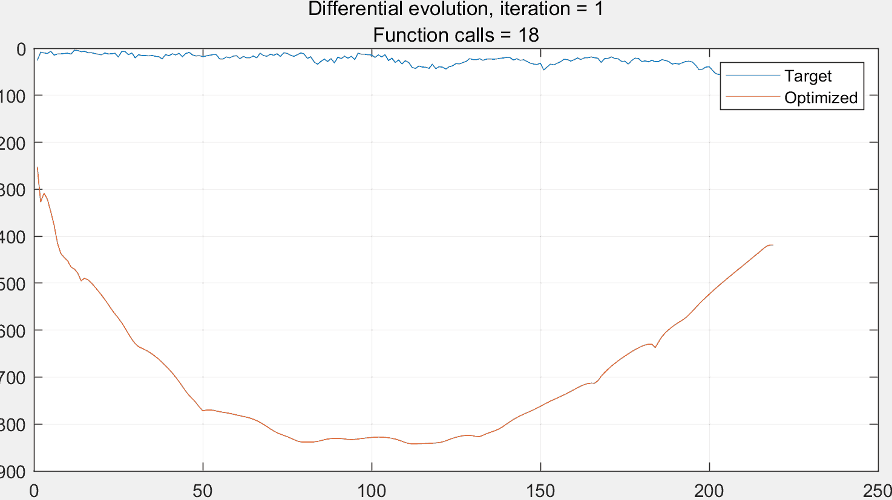
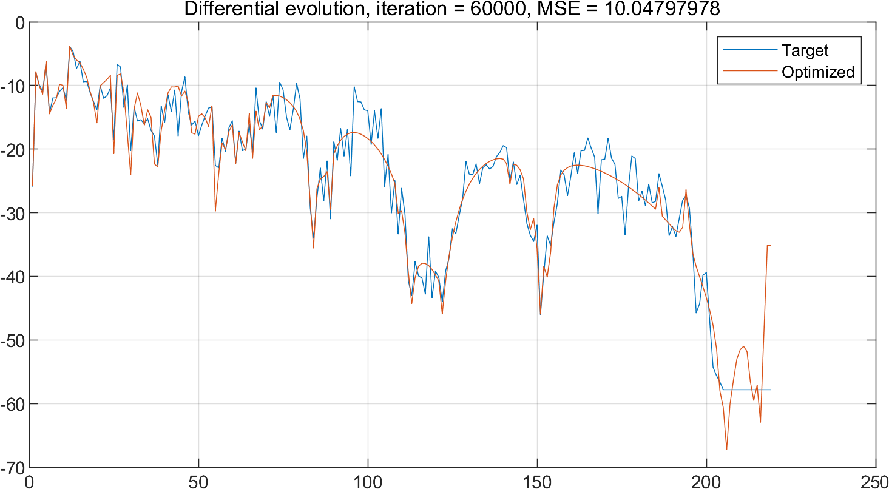
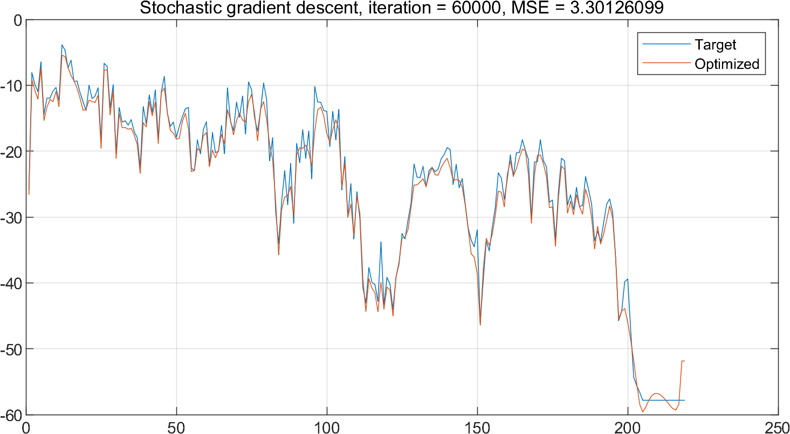

## Multivariate optimization library

See each sub-directory for different optimization approaches.

- A few metaheuristics algorithm have been implemented
- Reverse mode AD using my enhanced KANN library

PracticalExamples folder contains example of:

- Combine mathematical programming and metaheuristics to design of parametric IIR filters
As long as metaheuristics doesn't hurt solution and keep reduce cost function value :)

A example of optimization history of peaking fit, 6000 iterations:
Differential Evolution, oops! | Stochastic Gradient descent, great!
:-:|:-:
 | 

A example of optimization history of peaking fit, 60000 iterations:
Differential Evolution, not bad | Stochastic Gradient descent
:-:|:-:
 | 